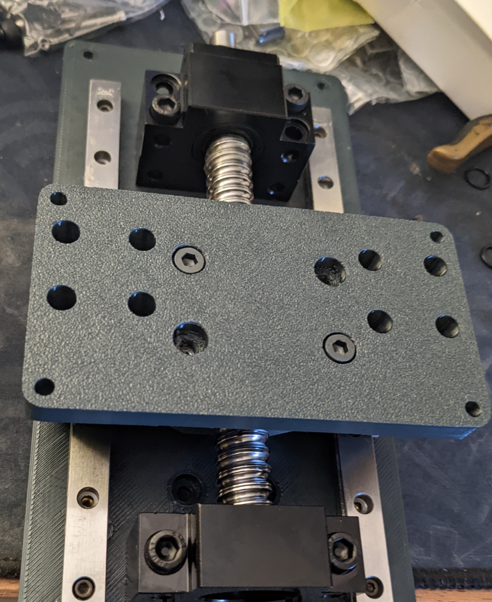
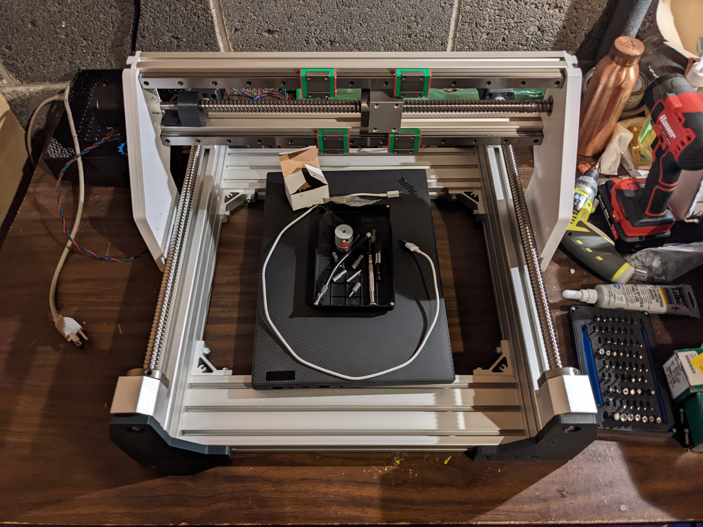
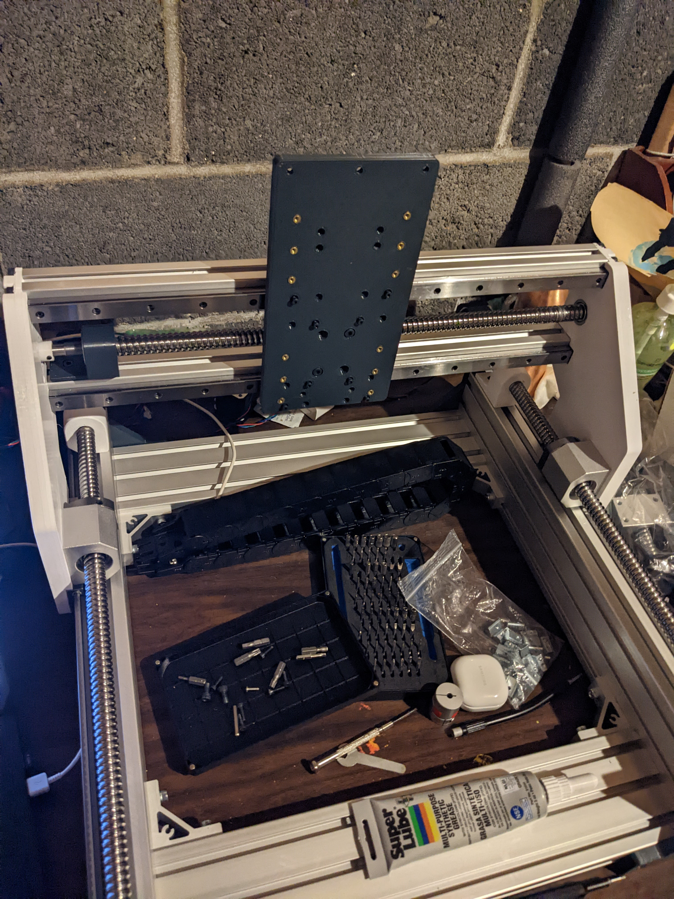
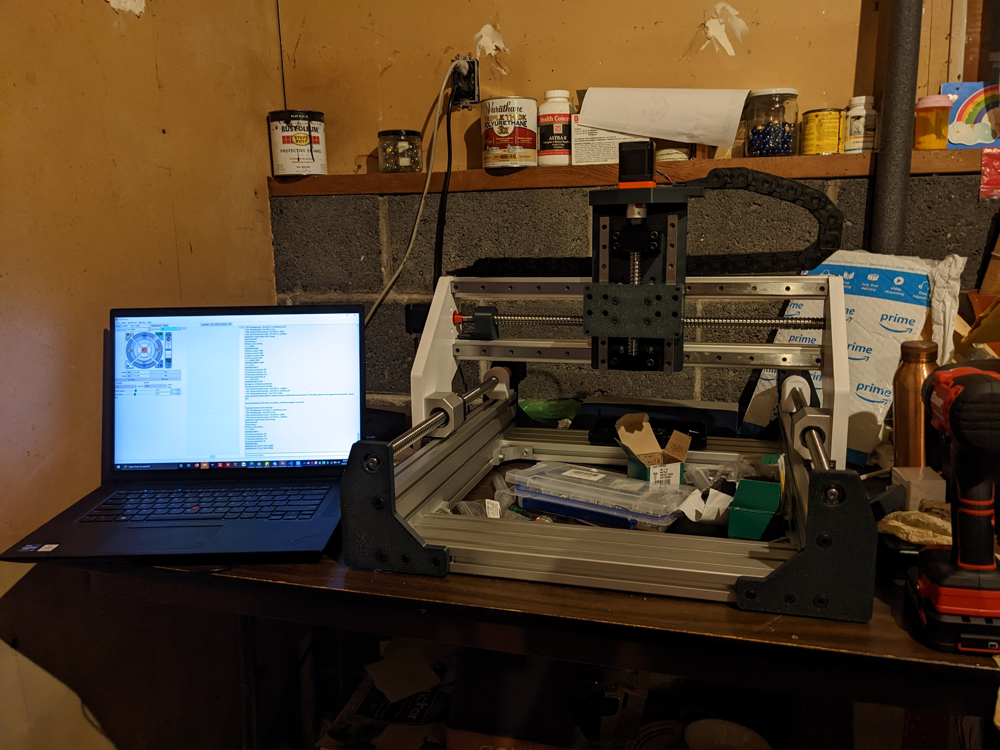
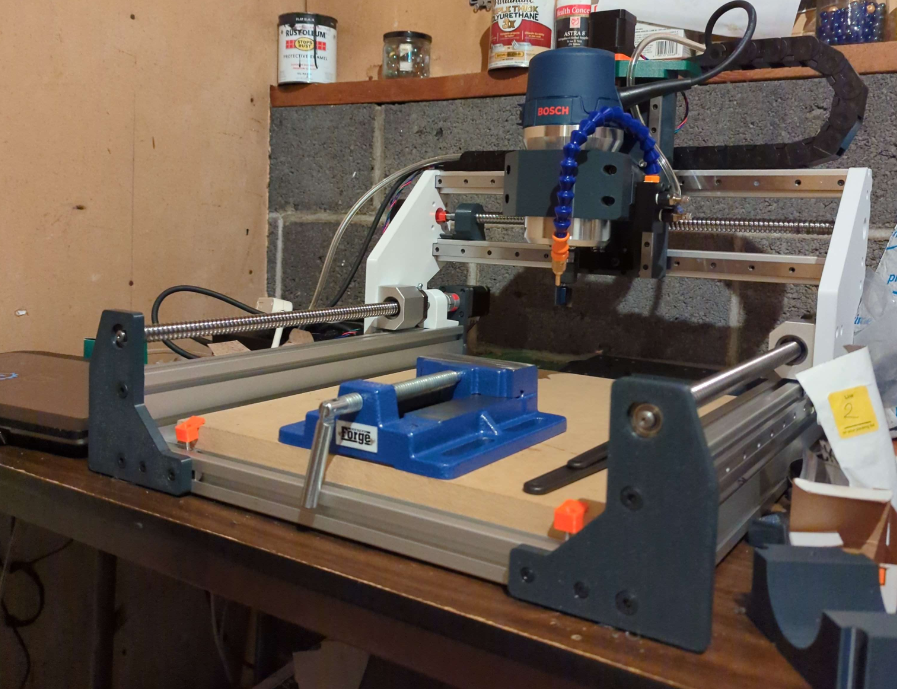

# The Microstepper CNC   

## Welcome to the GitHub page for the Microstepper CNC!   

  

# Current status: Troubleshooting / Verifying Clearances

This is a small project I started during my senior year of high school, where the intent was to design and manufacture a CNC router that was:

- Low-cost relative to other machines in its ballpark (FoxAlien Vasto, Shapeoko Standard/Pro)
- Sufficiently rigid
- Self-upgradeable
- Easy to design and maintain

My configuration of the motion system (not counting the router and end mills) costs about $1,050 as built. It uses roughly 2 kilograms of PETG plastic.
The components were designed in Autodesk Fusion 360, sliced in PrusaSlicer, and mostly manufactured on my Modified Creality Ender-5 Plus.

# Machine specifications

## Motion system:
- MGN15C rails and carriages on X and Y axes, MGN12H on Z axis.
- 1605 ball screws used for all drive systems. No belts.
- Built on Misumi 30-series extrusions (3030 and 3090).
- IGUS Energy Chains for cable management.

## Electronics and software
- NEMA 17 x 48mm Stepper Motors on every axis (NEMA 23 compatibility is planned).
- BOSCH 1617EVS 2.25HP Fixed-Base Router as Spindle (OD 89mm)
- IGUS Chainflex cables for extension wires.
- FYSETC Spider board running Trinamic TMC2209 stepper drivers.
- Sensorless homing on every axis.
- Running Marlin 2 open-source firmware! - F360 post processor can be found <a href="https://github.com/flyfisher604/mpcnc_post_processor">here</a>.

# Build Progress
Here are a couple pictures of my journey so far putting this machine together.

  

 

# What now? I want to build it!

Right now I'm still finalizing parts and the bill of materials. If you want the beta Fusion 360 files, they will be in the repository!